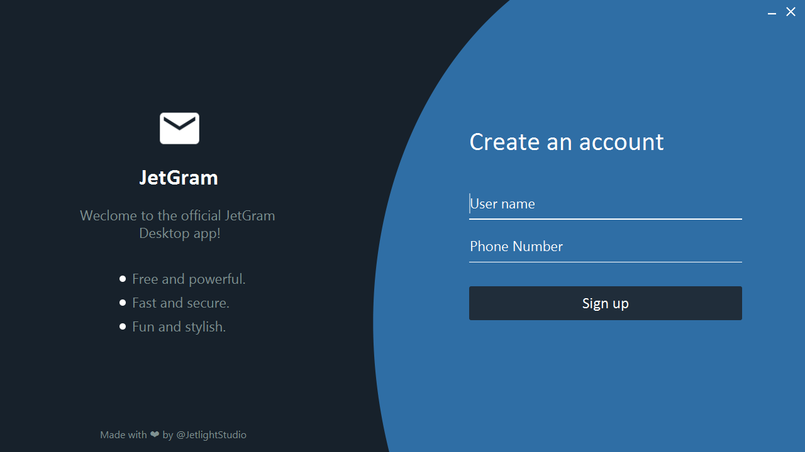
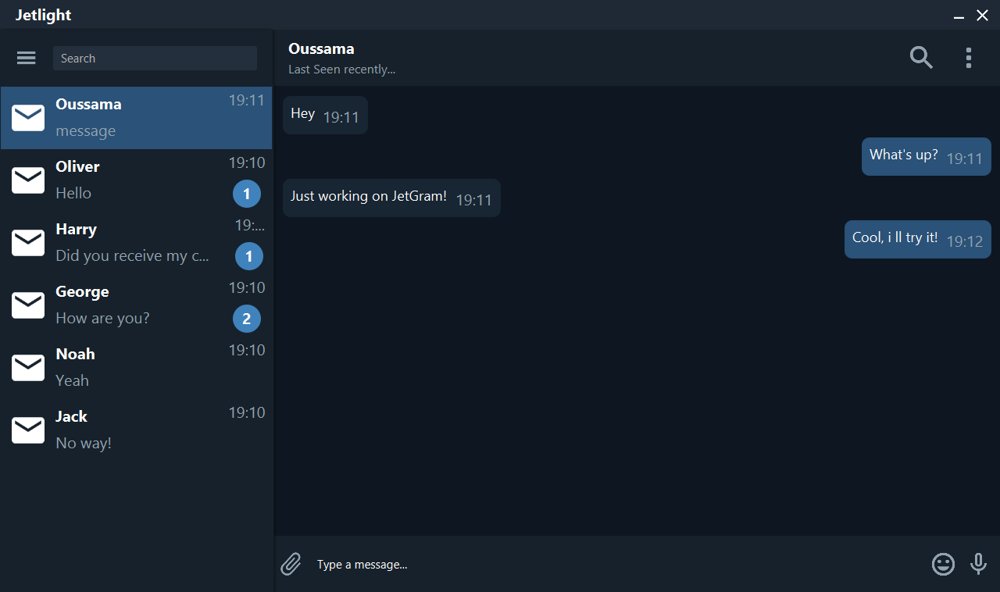
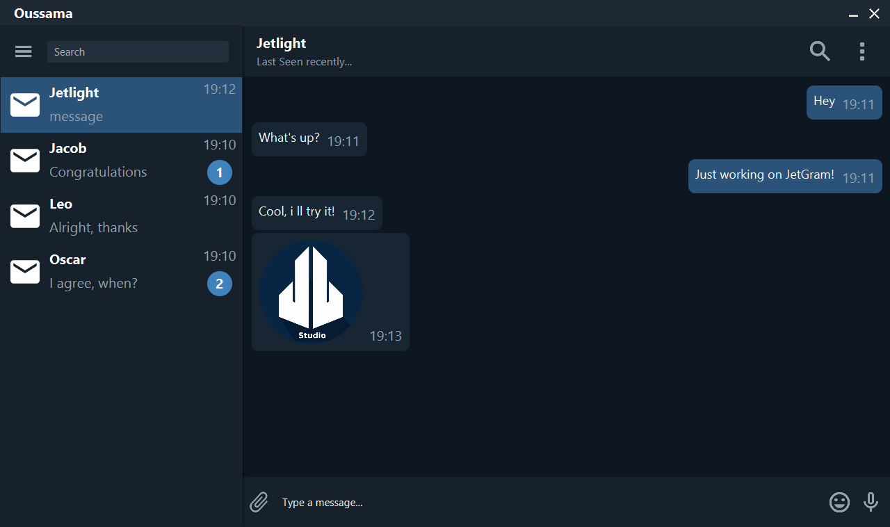

# TelegramClone

## Description:
JetGram is an open source desktop app [Telegram](https://github.com/telegramdesktop/tdesktop) clone made with JavaFx, it uses a local Java Socket based Server and the routing system is basic.

## What is Telegram?:
Telegram is a cloud-based instant messaging and voice over IP service. Telegram client apps are available for Android, iOS, Windows Phone, Windows NT, macOS and Linux. Users can send messages and exchange photos, videos, stickers, audio and files of any type.

## Screenshots:
### A beautiful UI:

### Send and receive messages:

### Send and receive images:

## TODO:
- [ ] Switch from local Java Server to something more powerful (like FireBase).
- [ ] Add the Accounts handling.
- [ ] Enable storage for messages, files, accounts, friends..etc.
- [ ] Fix Local image sending issues.
- [ ] Add messaging features like voice recodrings, calls, video chats..etc. 
- [ ] Add social media features like profile pictures, Emojies and stickers..etc.

## Tools & languages:    
* Intellij Idea (IDE).
* Java (Logic code).
* FXML & CSS (Design).
* Paint.Net (Image editting).
* Java Socket IO (message handling).

## How to use: 
 #### A stable release will be uploaded after completing the Todo tasks.
 * Fork, clone or download the project and open it with IntellijIdea (or any other IDE) and run the `Main.java` class.
 * Use two instances of the program to correctly test the messaging feautures. (One instance must act as a server) 

## Contribution:
Feel free to `fork` this project and add whatever you like. If you have any suggestions or any comments please feel free to contact me or to open an issue, use free license art assets please.

## Team:
[Jetlighters](https://github.com/JetLightStudio) having fun.
